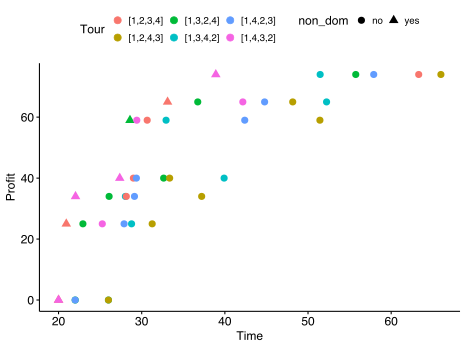

.. toctree::
   :maxdepth: 2
   :caption: Contents:

Ranking
=============================================================

We are very glad to finally make the results of this competition publicly available:

**1st: JoMar (25 points) - Jonatas Batista Costa das Chagas and Marcone Jamilson Freitas Souza**

2nd: shisunzhang (19 points) - Jialong Shi, Jianyong Sun, Qingfu Zhang

3rd: ALLAOUI (8 points) - Mohcin Allaoui, Belaid Ahiod

Congratulations to all of the winners! And even if you did not make it under the TOP3, I would like to thank you for the
participation. Knowing some methods work better than others is only possible if a variety of submissions are compared.

The evaluation is also available step by step `here <_static/evaluation.html>`_.

EMO2019 - Conference
=============================================================

.. image:: figures/logo.jpg
    :height: 100px

EMO 2019 is the 10th Edition of International Conference Series on Evolutionary Multi- Criterion Optimization (EMO), aiming to continue the success of previous EMO conferences.
We will bring together both the EMO, multiple criteria decision-making (MCDM) communities, and other related fields and, moreover,
focus on solving real-world problems in government, business and industry.

News
=============================================================

**March 12, 2019**: The winner of this competition was announced. Congratulations team JoMar (Jonatas Batista Costa das Chagas and Marcone Jamilson Freitas Souza)

**Feb 11, 2019**: Added Verify.java which allows you to make sure your submission files are in the correct format and x and f values map correctly.

**Jan 15, 2019**: Minor modification of Util.writeSolutions to make the tour of the submission based on index 1 and not 0. Either submission format will be accepted.

**Nov 26, 2018**: We are happy to announce the competition will start *December 1st, 2018*.

Motivation
=============================================================

Real-world optimization problems often consist of several NP-hard combinatorial optimization problems that interact with each other.
Such multi-component optimization problems are difficult to solve not only because of the contained hard optimization problems, but in particular,
because of the interdependencies between the different components.
Interdependence complicates a decision making by forcing each sub-problem to influence the quality and feasibility of solutions of the other sub-problems.
This influence might be even stronger when one sub-problem changes the data used by another one through a solution construction process.
Examples of multi-component problems are vehicle routing problems under loading constraints, maximizing material utilization while respecting a production schedule,
and relocation of containers in a port while minimizing idle times of ships.

The goal of this competition is to provide a platform for researchers in computational intelligence working on multi-component optimization problems.
The main focus of this competition is on the combination of TSP and Knapsack problems. However, we plan to extend this competition format to more complex combinations of problems (that have typically been dealt with individually in the past decades) in the upcoming years.

Competition
=============================================================

The Traveling Thief Problem was originally proposed in  :cite:`first_steps`. If you like to know more about the problem
origin we encourage you to read this paper as a starting point. The test problems used for this competition
were proposed in :cite:`Polyakovskiy:2014:CBS:2576768.2598249`. We selected a representative set to cover
varying scenarios for the traveling thief for this competition. The bi-objective traveling thief problem was discussed and investigated in
:cite:`Blank:2017:SBT:3088676.3088680`.

**How to get started**

For guidance, a sample Java implementation is provided: `here <https://github.com/julesy89/emo19-thief>`_.
You can find information about how to get started there as well. It should provide a starting point to get familiar
with the problem and prototype quickly new ideas.
However, for this competition you have the freedom to use whatever you need, e.g. speed up the evaluation function,
reimplement the problem in other programming languages (e.g. C, Matlab, Python).

**Test Instances**

The nine test instances:

====== ====== ================== ==============================================
#      n      Name               Instance in :cite:`Polyakovskiy:2014:CBS:2576768.2598249`
====== ====== ================== ==============================================
1      100    a280_n279          a280_n279_bounded-strongly-corr_01
2      100    a280_n1395         a280_n1395_uncorr-similar-weights_05
3      100    a280_n2790         a280_n2790_uncorr_10
4      50     fnl4461_n4460      fnl4461_n4460_bounded-strongly-corr_01
5      50     fnl4461_n22300     fnl4461_n22300_uncorr-similar-weights_05
6      50     fnl4461_n44600     fnl4461_n44600_uncorr_10
7      20     pla33810_n33809    pla33810_n33809_bounded-strongly-corr_01
8      20     pla33810_n169045   pla33810_n169045_uncorr-similar-weights_05
9      20     pla33810_n338090   pla33810_n338090_uncorr_10
====== ====== ================== ==============================================

For simplicity, we shortened the file name of the selected instances. However, the original instances are annotated above.
The column **n** represents the MAXIMUM number of non-dominated solutions being accepted for the submission for each test problem.

**Submission Format**

To participate in the competition it is required to submit your solutions for ALL test problems.
For each problem two files need to be submitted (i) one file that contains the tour and packing plan and (ii) one file
that contains the time and profits for each corresponding solution. The filenames are supposed to be *<team>_<problem>.x*
and *<team>_<problem>.f*.

First, the file containing the tour and packing plan (*<team>_<problem>.x*) contains for each solution two lines where the
first represents the permutation vector and the second line the packing plan encoded by 0 and 1. Then one empty line
is added to separate one solution from another. An example output can be found `here <_static/MY-TEAM_test-example-n4.x>`_.

Second the file containing the objective space values (*<team>_<problem>.f*) contains the corresponding time and profit
separated by space. An example output can be found `here <_static/MY-TEAM_test-example-n4.f>`_.

The test instances are included in the Github project and a method to run your algorithm on them already exists.

**Submission**

Deadline for this competition is the

.. rst-class:: center

    **20th February, 2019, Midnight, UTC-12**

Before you submit please make sure to verify the correctness of your solutions using **Verify.java**
(You might need to pull the latest version of the project).

Please submit by sending an email to blankjul@egr.msu.edu with the subject: **EMO2019 Competition - Traveling Thief Submission**
and provide as a link where we are able to download your results.

**Evaluation**

After having received all submissions, the evaluation will be done as follows:

*For each of the nine test problems*

a. We will merge the solution sets of all submissions and extract the non-dominated set.
b. The minimum in time and the maximum in profit will be used to determine the reference point.
c. With respect to this reference point the quality of each submission will be measured using the hypervolume indicator.
d. We will sort the submissions according to the achieved hypervolume in descending order and give points as follows: 1st place -> 3 points, 2nd place -> 2 points, 3rd place -> 1 point.

By adding up the points for each submission we will create the overall ranking.
*Please note, that depending on the number of submissions the evaluation might need to be reconsidered.*

Problem
=============================================================

The traveling thief problem combines the Traveling Salesman Problem (TSP) and the Knapsack Problem (KNP). Both problems will be explained in the following sections.

Traveling Salesman Problem (TSP)
---------------------------------------------

In the TSP a salesman has to visit :math:`n` cities. The distances are given by a map represented as a distance matrix :math:`A = (d_{ij})` with :math:`i,j \in \{0,..,n\}`. The salesman has to visit each city once and the result is a permutation vector :math:`\pi = (\pi_1, \pi_2, ..., \pi_n)` , where :math:`\pi_i` is the i-th city of the salesman.
The distance between two cities divided by a constant velocity :math:`v` results in the traveling time for the salesman denoted by :math:`f(\pi)`.
The goal is to minimize the total traveling time of the tour:

.. math::
   :nowrap:

    \begin{eqnarray}
        min & & f(\pi)  \\
        s.t. & &\pi = (\pi_1, \pi_2, ..., \pi_n) \in P_n \\[1mm]
        & &\pi_1 = 1 \\[1mm]
        f(\pi) & = & \sum_{i=1}^{n-1} \frac{ d_{\pi_i, \pi_{i+1}}}{v} \; +  \; \frac{ d_{\pi_n, \pi_{1}}}{v}\nonumber
    \end{eqnarray}

There are :math:`\frac{(n-1)!}{2}` different tours to consider,
if we assume that the salesman has to start from the first city
and travels on a symmetric map where :math:`d_{i,j} = d_{j,i}`.

Knapsack Problem (KNP)
---------------------------------------------

For the Knapsack Problem a knapsack has to be filled with items without violating the maximum weight constraint. Each item :math:`j` has a value :math:`b_j \geq 0`  and a weight :math:`w_j \geq 0` where :math:`j \in \{1, .., m\}`.
The binary decision vector :math:`z = (z_1, .., z_m)` defines, if an item is picked or not.
The search space of this problem contains `2^n` combinations and the goal is to maximize the profit :math:`g(z)`:

.. math::
   :nowrap:

    \begin{eqnarray}
        max & & g(z) \\
        \text{s.t.} & & \sum_{j=1}^m z_j \, w_j \leq Q\\
        & & z = (z_1, .., z_m) \in \mathbb{B}^m\\
        g(z) & = & \sum_{j=1}^{m}  z_j \, b_j \\
    \end{eqnarray}

Traveling Thief Problem (TTP)
---------------------------------------------

The TTP is a combinatorial optimization problem that consists of two interweaving problems, TSP and KNP.
After explaining the two components separately, the interdependence and the different models of the problem are described.

The Traveling Thief Problem combines the above defined subproblems and lets them interact with each other. The traveling thief can collect items from each city he is visiting. The items are stored in a knapsack carried by him. In more detail,
each city :math:`\pi_i` provides one or multiple items, which could be picked by the thief. There is an interaction between the subproblems:
The velocity of the traveling thief depends on the current knapsack weight :math:`w`, which is carried by him. It is calculated by considering all cities, which were visited so far, and summing up the weights of all picked items. The weight at city :math:`i` given :math:`\pi` and :math:`z` is calculated by:

.. math::
   :nowrap:

   \begin{equation}
    w(i, \pi, z) = \sum_{k=1}^{i} \sum_{j=1}^{m} a_j(\pi_k)\; w_j z_j
   \end{equation}

The function :math:`a_j(\pi_k)` is defined for each item :math:`j` and returns :math:`1` if the item could be stolen at city :math:`\pi_k` and :math:`0` otherwise.
The current weight of the knapsack has an influence on the velocity.
When the thief picks an item, the weight of the knapsack increases and therefore the velocity of the thief decreases.

The velocity :math:`v` is always in a specific range :math:`v = [v_{min}, v_{max}]` and could not be negative for a feasible solution.
Whenever the knapsack is heavier than the maximum weight :math:`Q`, the capacity constraint is violated.
However, to provide also the traveling time for infeasible solutions the velocity is set to :math:`v_{min}`, if :math:`w>Q`:

.. math::
   :nowrap:

    \begin{align}
     v(w) &=
      \begin{cases}
       \; v_{max} - \frac{w}{Q} \cdot (v_{max} - v_{min}) & \text{if } w \leq Q \\
       \; v_{min}        & \text{otherwise}
      \end{cases}
    \end{align}

If the knapsack is empty the velocity is equal to :math:`v_{max}`.
Contrarily, if the current knapsack weight is equal to :math:`Q` the velocity is :math:`v_{min}`.

Furthermore, the traveling time of the thief is calculated by:

.. math::
   :nowrap:

    \begin{equation}
    f(\pi, z) = \sum_{i=1}^{n-1} \frac{ d_{\pi_i, \pi_{i+1}}}{ v( w(i,\pi,z) )  }
    \; + \; \; \frac{ d_{\pi_n, \pi_{1}}}{ v( w(n,\pi,z) )}  \\
    \end{equation}

The calculation is based on TSP, but the velocity is defined by a function instead of a constant value.
This function takes the current weight, which depends on the index :math:`i` of the tour.
The current weight, and therefore also the velocity, will change on the tour by considering the picked items defined by :math:`z`.
In order to calculate the total tour time, the velocity at each city needs to be known.
For calculating the velocity at each city the current weight of the knapsack must be given.
Since both calculations are based on :math:`z` and :math:`z` is part of the knapsack subproblem, it is very challenging to solve the problem to optimality. 
In fact, such problems are called interwoven systems as the solution of one subproblem highly depends on the solution of the other subproblems.

Here, we leave the profit unchanged to be calculated as in the KNP problem.
Finally, the TTP problem is defined by

.. math::
   :nowrap:

    \begin{eqnarray}
        min & & f(\pi, z)  \\
        max & & g(z) \\

        f(\pi, z) & = & \sum_{i=1}^{n-1} \frac{ d_{\pi_i, \pi_{i+1}}}{ v( w(i,\pi,z) )  }
            \; + \; \; \frac{ d_{\pi_n, \pi_{1}}}{ v( w(n,\pi,z) )}  \\[1mm]

        g(z) & = & \sum_{j=1}^{m}  z_j \, b_j \\

        s.t. & &\pi = (\pi_1, \pi_2, ..., \pi_n) \in P_n \\[1mm]
        & & \pi_1 = 1 \\[1mm]
        & & z = (z_1, .., z_m) \in \mathbb{B}^m\\
        & & \sum_{j=1}^m z_j \, w_j \leq Q\\

    \end{eqnarray}

In order to illustrate the equations and interdependence, an example scenario is presented in the following.
The thief starts at city 1 and has to visit city 2, 3, 4 exactly once and to return to city 1.
In this example, each city provides one item and the thief must decide to steal item or not.

.. image:: figures/scenario.svg
    :align: center
    :width: 400px

A permutation vector, which contains all cities exactly once, and a binary picking vector are needed to calculate the objectives.
Even though, this is a very small example with four cities and three items the solution space consists of :math:`(n-1)! \cdot 2^m = 6 \cdot 8 = 48` combinations.

In order to understand how the objectives are calculated, an example hand calculation for the tour *[1,3,2,4]* and the packing plan *[1,0,1]* is done as follows:
The thief starts with the maximum velocity, because the knapsack is empty. He begins his tour at city *1* and picks no item there.

For an empty knapsack :math:`w(1,\pi,z) = 0` the velocity is :math:`v(0) = v_{max} = 1.0`. The distance from city *1* to city *3* is :math:`9.0` and the thief needs :math:`9.0` time units.
At city *3* the thief will not pick an item and continue to travel to city *2* with :math:`w(2,\pi,z) = 0` and therefore with :math:`v_{max}` in additional :math:`5.0` time units.
Here he picks item *1* with :math:`w_1 = 30` and the current weight becomes :math:`w(2,\pi,z) = 30`,
which means the velocity will be reduced to :math:`v(30) = 1.0 - (\frac{1.0 - 0.1}{80}) \cdot 30 = 0.6625`.
For traveling from city *2* to city *4* the thief needs the distance divided by the current velocity :math:`\frac{5.0}{0.6625} \approx 7.5472`.
At city *4* he picks item *3* with :math:`w_3 = 21` and the current knapsack weight increases to :math:`w(4,\pi,z) = 30 + 21 = 51`.
For this reason the velocity decreases to :math:`v(51) = 1.0 - (\frac{1.0 - 0.1}{80}) \cdot 51 = 0.42625`.
For returning to city *1* the thief needs according to this current speed :math:`\frac{3.0}{0.42625} \approx 7.0381` time units.
Finally, we sum up the time for traveling from each city to the next :math:`\sum_{k=1}^{4} t_{\pi_k, \pi_{k+1}} = 9 + 5 + 7.5472 + 7.0381 = 28.5853` to calculate the whole traveling time.

The final profit is calculated by summing up the values of all items which is :math:`34 + 25 = 59`. So the variable *[1,3,2,4]* *[1,0,1]* is mapped to the point :math:`(28.59, 59.0)` in the objective space.
Below you can find all pareto-optimal solutions of this example. The Pareto front contains 8 solutions and our hand calculation is printed bold.

Additionally, the figure below shows the objective space colored by tour. As it can be observed pareto-optimal solutions
can have different underlying tours. Please also not that the point where no items are picked consists of two different solutions
with a symmetric tour. Also, the Pareto front is non-convex.

Contact
=============================================================

| Julian Blank (blankjul [at] egr.msu.edu)
| Michigan State University
| Computational Optimization and Innovation Laboratory (COIN)
| East Lansing, MI 48824, USA

| Markus Wagner (markus.wagner [at] adelaide.edu.au)
| The University of Adelaide, Australia
| Adelaide, SA 5005, Australia

References
==================================

.. bibliography:: references.bib
   :style: unsrt
   :all:

