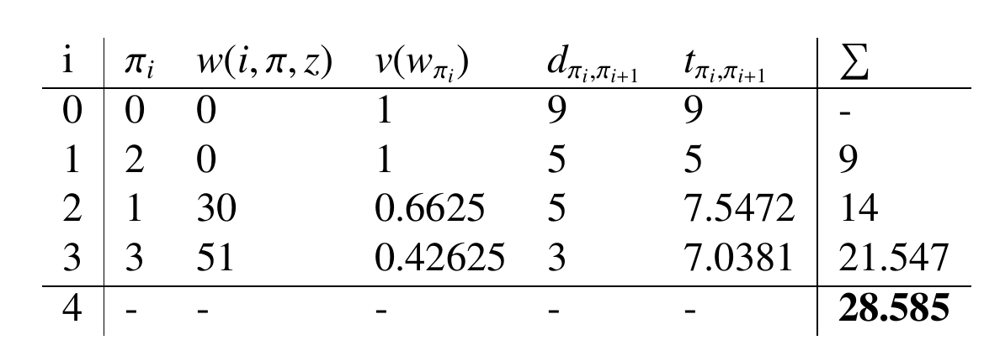
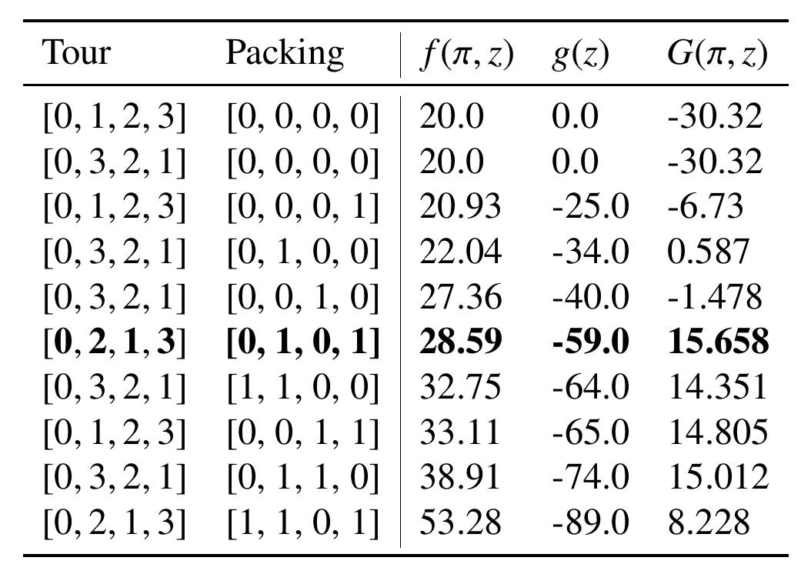
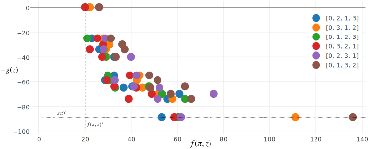

.. toctree::
   :maxdepth: 2
   :caption: Contents:

EMO2019 - Conference
=============================================================

EMO 2019 is the 10th Edition of International Conference Series on Evolutionary Multi- Criterion Optimization (EMO), aiming to continue the success of previous EMO conferences.
We will bring together both the EMO, multiple criteria decision-making (MCDM) communities, and other related fields and, moreover,
focus on solving real-world problems in government, business and industry.

News
=============================================================

**October 17, 2018:** We are happy to announce the competition will start *December 1st, 2018*.

Motivation
=============================================================

Real-world optimization problems often consist of several NP-hard combinatorial optimization problems that interact with each other.
Such multi-component optimization problems are difficult to solve not only because of the contained hard optimization problems, but in particular,
because of the interdependencies between the different components.
Interdependence complicates a decision making by forcing each sub-problem to influence the quality and feasibility of solutions of the other sub-problems.
This influence might be even stronger when one sub-problem changes the data used by another one through a solution construction process.
Examples of multi-component problems are vehicle routing problems under loading constraints, the maximizing material utilization while respecting a production schedule,
and the relocation of containers in a port while minimizing idle times of ships.

The goal of this competition is to provide a platform for researchers in computational intelligence working on multi-component optimization problems.
The main focus of this competition is on the combination of TSP and Knapsack problems. However, we plan to extend this competition format to more complex combinations of problems (that have typically been dealt with individually in the past decades) in the upcoming years.

Competition
=============================================================

This competition aims to solve the Bi-objective Traveling Thief Problem for large instances.

Problem
=============================================================

The traveling thief problem combines the Traveling Salesman Problem (TSP) and the Knapsack Problem (KNP). Both problems will be explained in the following.

Traveling Salesman Problem (TSP)
---------------------------------------------

In the TSP a salesman has to visit :math:`n` cities. The distances are given by a map represented as a distance matrix :math:`A = (d_{ij})` with :math:`i,j \in \{0,..,n\}`. The salesman has to visit each city once and the result is a permutation vector :math:`\pi = (\pi_1, \pi_2, ..., \pi_n)` , where :math:`\pi_i` is the i-th city of the salesman.
The distance between two cities divided by a constant velocity :math:`v` results in the traveling time for the salesman denoted by :math:`f(\pi)`.
The goal is to minimize the total traveling time of the tour:

.. math::
   :nowrap:

    \begin{eqnarray}
        min & & f(\pi)  \\
        s.t. & &\pi = (\pi_1, \pi_2, ..., \pi_n) \in P_n \\[1mm]
        f(\pi) & = & \sum_{i=1}^{n-1} \frac{ d_{\pi_i, \pi_{i+1}}}{v} \; +  \;
        \frac{ d_{\pi_n, \pi_{1}}}{v}\nonumber
    \end{eqnarray}

There are :math:`\frac{(n-1)!}{2}` different tours to consider,
if we assume that the salesman has to start from the first city
and travels on a symmetric map where :math:`d_{i,j} = d_{j,i}`.

Knapsack Problem (KNP)
---------------------------------------------

For the Knapsack Problem a knapsack has to be filled with items without violating the maximum weight constraint. Each item :math:`j` has a value :math:`b_j \geq 0`  and a weight :math:`w_j \geq 0` where :math:`j \in \{1, .., m\}`.
The binary decision vector :math:`z = (z_1, .., z_m)` defines, if an item is picked or not.
The search space of this problem contains `2^n` combinations and the goal is to maximize the profit :math:`g(z)`:

.. math::
   :nowrap:

    \begin{eqnarray}
        max & & g(z) \\
        \text{s.t.} & & \sum_{j=1}^m z_j \, w_j \leq Q\\
        & & z = (z_1, .., z_m) \in \mathbb{B}^m\\
        g(z) & = & \sum_{j=1}^{m}  z_j \, b_j \\
    \end{eqnarray}

Traveling Thief Problem (TTP)
---------------------------------------------

The TTP is a combinatorial optimization problem that consists of two interweaving problems such as TSP and KNP.
After explaining the two components separately, the interdependence and the different models of the problem are described.

The Traveling Thief Problem combines the above defined subproblems and let them interact together. The traveling thief can collect items from each city he is visiting. The items are stored in a knapsack carried by him. In more detail,
each city :math:`\pi_i` provides one or multiple items, which could be picked by the thief. There is an interaction between the subproblems:
The velocity of the traveling thief depends on the current knapsack weight :math:`w`, which is carried by him. It is calculated by considering all cities, which were visited so far, and summing up the weights of all picked items. The weight at city :math:`i` given :math:`\pi` and :math:`z` is calculated by:

.. math::
   :nowrap:

   \begin{equation}
    w(i, \pi, z) = \sum_{k=1}^{i} \sum_{j=1}^{m} a_j(\pi_k)\; w_j z_j
   \end{equation}

The function :math:`a_j(\pi_k)` is defined for each item :math:`j` and returns :math:`1` if the item could be stolen at city :math:`\pi_k` and :math:`0` otherwise.
The current weight of the knapsack has an influence on the velocity.
When the thief picks an item, the weight of the knapsack increases and therefore the velocity of the thief decreases.

The velocity :math:`v` is always in a specific range :math:`v = [v_{min}, v_{max}]` and could not be negative for a feasible solution.
Whenever the knapsack is heavier than the maximum weight :math:`Q`, the capacity constraint is violated.
However, to provide also the traveling time for infeasible solutions the velocity is set to :math:`v_{min}`, if :math:`w>Q`:

.. math::
   :nowrap:

    \begin{align}
     v(w) &=
      \begin{cases}
       \; v_{max} - \frac{w}{Q} \cdot (v_{max} - v_{min}) & \text{if } w \leq Q \\
       \; v_{min}        & \text{otherwise}
      \end{cases}
    \end{align}

If the knapsack is empty the velocity is equal to :math:`v_{max}`.
Contrarily, if the current knapsack weight is equal to :math:`Q` the velocity is :math:`v_{min}`.

Furthermore, the traveling time of the thief is calculated by:

.. math::
   :nowrap:

    \begin{equation}
    f(\pi, z) = \sum_{i=1}^{n-1} \frac{ d_{\pi_i, \pi_{i+1}}}{ v( w(i,\pi,z) )  }
    \; + \; \; \frac{ d_{\pi_n, \pi_{1}}}{ v( w(n,\pi,z) )}  \\
    \end{equation}

The calculation is based on TSP, but the velocity is defined by a function instead of a constant value.
This function takes the current weight, which depends on the index :math:`i` of the tour.
The current weight, and therefore also the velocity, will change on the tour by considering the picked items defined by :math:`z`.
In order to calculate the total tour time, the velocity at each city needs to be known.
For calculating the velocity at each city the current weight of the knapsack must be given.
Since both calculations are based on :math:`z` and :math:`z` is part of the knapsack subproblem, it is very hard to solve the problem.
In fact, such problems are called interwoven systems as the solution of one subproblem highly depends on the solution of the other subproblems.

Here, we leave the profit unchanged to be calculated as in the KNP problem by:

.. math::
   :nowrap:

    \begin{eqnarray}
        max & & g(z) \\
        \text{s.t.} & & \sum_{j=1}^m z_j \, w_j \leq Q\\
        & & z = (z_1, .., z_m) \in \mathbb{B}^m\\
        g(z) & = & \sum_{j=1}^{m}  z_j \, b_j \\
    \end{eqnarray}

In order to illustrate the equations and interdependence, an example scenario is presented in the following.
The thief starts at city *0* and has to visit city *{1, 2, 3}* exactly once and to return to city *0*.
In this example each city provides one item and the thief could decide to steal item :math:`I_j` or not.
For the further example we use a zero index based notation for the vectors :math:`\pi` and :math:`z` and the first city is at index *0*.

A permutation vector, which contains all cities exactly once, and a binary picking vector are needed to calculate the objectives.
Even though, this is a very small example with four cities and four items the solution space consists of :math:`(n-1)! \cdot 2^m = 6 \cdot 16 = 96` combinations.

In order to understand how the objectives are calculated, an example hand calculation for the tour *[0,2,1,3]* and the packing plan *[0,1,0,1]* is done as follows:
The thief starts with the maximum velocity, because the knapsack is empty. He begins his tour at city *0* and picks no item there.

For an empty knapsack :math:`w(0,\pi,z) = 0` the velocity is :math:`v(0) = v_{max} = 1.0`. The distance from city *0* to city *2* is `:math:9.0` and the thief needs :math:`9.0` time units.
At city *2* the thief will not pick an item and continue to travel to city 1 with :math:`w(1,\pi,z) = 0` and therefore with :math:`v_{max}` in additional :math:`5.0` time units.
Here he picks item :math:`I_1` with `w_1 = 30` and the current weight becomes :math:`w(2,\pi,z) = 30`,
which means the velocity will be reduced to :math:`v(30) = 1.0 - (\frac{1.0 - 0.1}{80}) \cdot 30 = 0.6625`.
For traveling from city 1 to city 3 the thief needs the distance divided by the current velocity :math:`\frac{5.0}{0.6625} \approx 7.5472`.
At city 3 he picks :math:`I_3` with :math:`w_3 = 21` and the current knapsack weight increases to :math:`w(3,\pi,z) = 30 + 21 = 51`.
For this reason the velocity decreases to :math:`v(51) = 1.0 - (\frac{1.0 - 0.1}{80}) \cdot 51 = 0.42625`.
For returning to city 0 the thief needs according to this current speed :math:`\frac{3.0}{0.42625} \approx 7.0381` time units.
Finally, we sum up the time for traveling from each city to the next :math:`\sum_{k=0}^{n-1} t_{\pi_k, \pi_{k+1}} = 9 + 5 + 7.5472 + 7.0381 = 28.5853` to calculate the whole traveling time.

The final profit is calculated by summing up the values of all items which is :math:`34 + 25 = 59`. So the variable *[0,2,1,3]* *[0,1,0,1]* is mapped to the point :math:`(28.59, 59.0)` in the objective space.
The Pareto front contains 10 solutions and our hand calculation is printed bold at Table~\ref{tbl:example_front}.

Additionally, the figure below shows the objective space colored by tour.
The vertical line denoted by :math:`f(\pi,z)^*` illustrates solutions where the time of the thief is minimized.
Furthermore, all solutions on the horizontal line denoted by :math:`- g(z)^*` have the maximum profit.
More detailed studies of this objective space are done during this publication.

Contact
=============================================================

